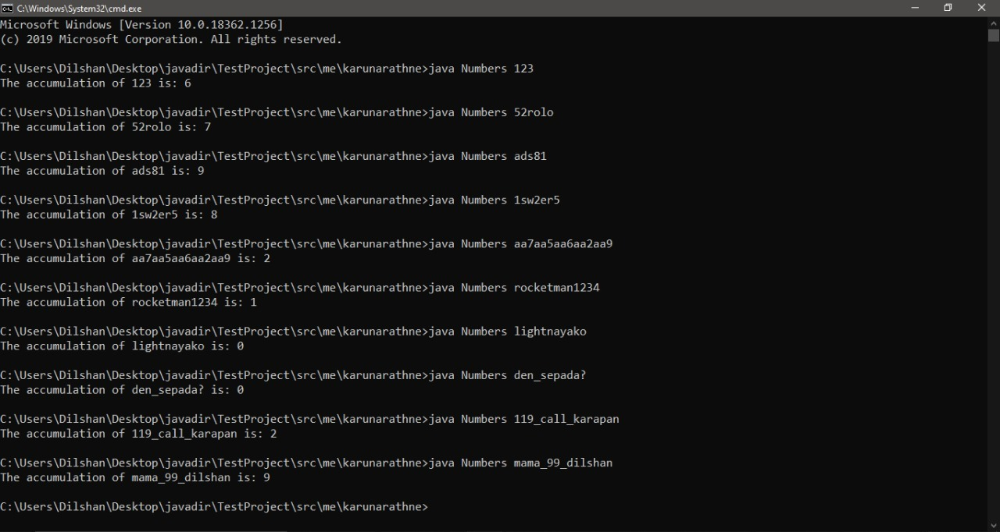

# Accumulate Numbers

### Difficulty: Easy  
Write a program that takes a string as the input, and calculates the digit sum **A** of all the digits in that string.  
Take a look at the sample input - output to get the gist.  

## Input Format
A string. It may contain any number of characters.  

## Constraints
**A** < 10  
**A** must be an integer.  

## Output Format
Print the digit sum of all the digits in the input string. 

## Sample Input - Output

## Important
Feel free to use any programming language. (Eg: **Java** or **C++**)  
If the user's input is not correct, you should throw an exception. For those who are unfamiliar with exception handling, just print an Error message.  

#### Question was created by
Sacheera Madushan  
[GitHub/sachira-madhushan](https://github.com/sachira-madhushan)  

