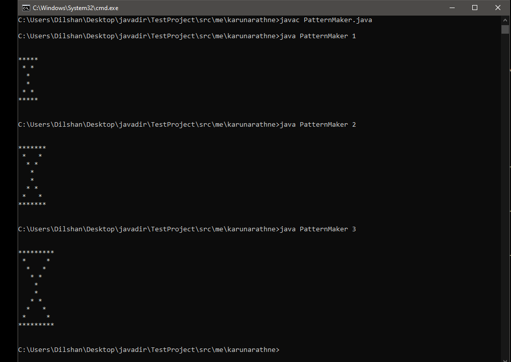

# Hollow Pyramids

### Difficulty: Easy  
Create a star pattern of two hollow pyramids. (You must use loops.)  
Size **S** here, indicates the possible size of the final pattern. The smallest version (**S** = 1), should be the smallest possible pattern, where the hollow space is just one space. And the next smallest possible size (**S** = 2), should have four whitespaces as the hollow part, in the first middle line: a single space, and the second one with three spaces.  
Look at the sample input - output to get the gist. 

## Input Format
User should be able to input the size of the pyramid **S**. 

## Constraints
**S** > 0  
**S** must be an integer. 

## Output Format
Print the pattern, according to the size given by the user. 

## Sample Input - Output

## Important
Feel free to use any programming language. (Eg: **Java** or **C++**)  
If the user's input is not correct, you should throw an exception. For those who are unfamiliar with exception handling, just print an Error message.  

#### Question was created by
Dilshan Karunarathne  
[GitHub/dilshankarunarathne](https://github.com/dilshankarunarathne)  
[http://dilshan.cf/](http://dilshan.cf/)  
[http://www.karunarathne.me/](http://www.karunarathne.me/)  

