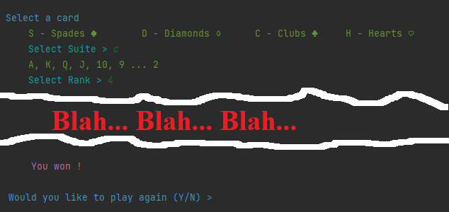

# Buru

### Difficulty: Medium

You are assigned to create a console application, that can play the classic Sri Lankan ***Buru*** game.  
The game is simple. First, the card pack needs to be shuffled, and divided into two sets. One set goes to the player, and the other set goes to the opponent (in this case, the computer program). The player (user) should be able to request a card. And if that card is in the player's set, the player wins.

## Input Format
The player should be prompted to input a desired playing card.  
First, let the player choose a suit. And then ask the player to choose a card. 

## Constraints
1. The card pack, should contain all four suits.  
>Clubs ♣, Diamonds ♢, Spades ♠ and Hearts ♡ 
2. Each suit should contain all thirteen cards.   
>Ace **A**, King **K**, Queen **Q**, Jack **J**, Ten **10**, Nine **9**, Eight **8**, Seven **7**, Six **6**, Five **5**, Four **4**, Three **3** and Deuce **2**  
3. The shuffling must be random. (You are allowed to use the built in functions)
4. **You must use Object-Oriented Programming for this.**

## Output Format
If the player wins, print out `You won` .  
If the opponent wins, print out `You lost` .

## Sample Input - Output
On the way....

 

## Important
Feel free to use any programming language. 
> Eg: **Java** or **C++**  

If the user's input is not correct, you should throw an exception. For those who are unfamiliar with exception handling, just print an Error message.  

### This question was created by
Dilshan M. Karunarathne  
[GitHub/dilshankarunarathne](https://github.com/dilshankarunarathne)  
[http://www.dilshan.cf/](http://dilshan.cf/)  
[http://www.karunarathne.me/](http://www.karunarathne.me/)  

> 6th March, 2022
